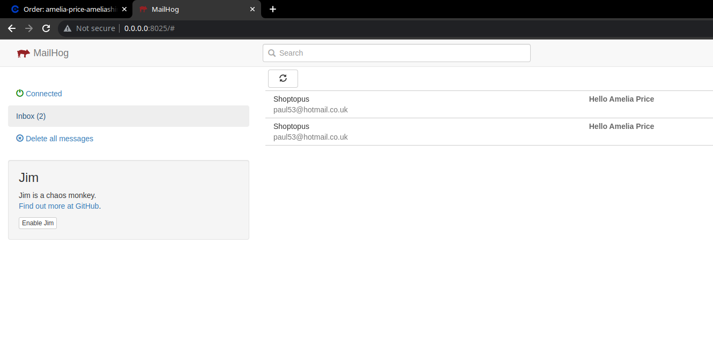

```
       MMMMMMMMM                                                                                                        
     MMMMMMMMMMMMM                  MMM                                                                                 
    MMMMMMMMMMMMMMM                 MMM                               OMM~                                              
    MMMMMMMMMMMMMMMM                MMM            .                  OMM=                   .            .             
   MMMMMMMMMMMMMMMMM        ~MMMMM  MMM?MMMMM  . MMMMMM    MMMMMMMM  7MMMMMM   MMMMMM    MMMMMMMM   MMM    MMM .MMMMMM  
   MMMM. MMMMM. MMMM.      ZMMMMMM, MMMM  MMMM. MMMMMMMMM  MMMM MMMM 7MMMMMM .MMMMOMMMM  MMMM $MMM  MMM    MMM MMMMMMM  
  . MMMMMMMMMMMMMMMD       +MMMI    MMM    MMM MMM    MMM. MM.   +MMM 7MM7   MMM   .MMM  MMM    MMM MMM    MMM MMMM     
.MM :MMMMMMMMMNMMMM MMM      NMMMMM MMM    MMM.MMM    MMM  MM     MMM 7MM7   MMM    OMM7 MMM   .MMM.MMM    MMM   MMMMMO 
MMM. MMMMMM=8MMMMM  MMM     MM .MMM.MMM    MMM NMMM  MMMM  MMM   MMM   MMM    MMM. +MMM  MMM:  MMMM MMM$  MMMM  MM  MMM 
MMMMMMMMMMMMMMMMMMMMMMM     MMMMMMZ MMM    MMM   MMMMMMM   MMMMMMMM .  MMMMM  .MMMMMMM   MMMMMMMMI   MMMMMMMMM DMMMMMM. 
IMMMMMMMMMMMMMMMMMMMMMM      .  .                  .       MMM                           MMM .                          
  MMMMMMMMMMMMMMMMMMM                                      MMM                           MMM                            
 .MMMMMMMMM MMMMMMMMM                                      MMM                           MMM                            
  MMMMMMM     MMMMMMMN  
```  

# Introduction
Welcome to Shoptopus. It is a multi-purpose e-commerce platform based on Laravel.

# Installation
## Docker
- Use the official [guide](https://docs.docker.com/engine/install/) to install docker on your system
- Use the official [guide](https://docs.docker.com/compose/install/) to install docker compose

## Install the ssl certificates
- Install [mkcert](https://mkcert.org/) on your system.
- Once mkcert is available, locate the following folder: `[PROJECT ROOT]/docker-config/reverse-proxy/ssl`
- Then inside this folder, run `$ mkcert -install shoptopus.test`
- If all is well, you should see a message saying your certificate has been installed as well as see `shoptopus.test.key` and `shoptopus.test-key.pem` files appearing in the folder.


> You do not need to do anything with the certificates. They will be picked up and used by traefik.

## Add the url-s to your hosts file.
- Locate the `/etc/hosts` file in your system and add the following values to it:
```
127.0.0.1  shoptopus.test
127.0.0.1  es.shoptopus.test
127.0.0.1  kb.shoptopus.test
```

## Start the containers
- Run `$ docker-compose up -d`


## Composer packages
- Run `$ docker-compose run sh-composer install`


## Set up the databases
> The database host in your .env should be set to the mysql container's name (sh-mysql)

## Clear the config
- Run `$ docker-compose run sh-artisan optimize:clear`

## Migrations and test data
- Run `$ docker-compose run sh-artisan shop:fresh`
- Select the appropriate option for your use-case.

## Take a database snapshot
- Run `$ ./db_snapshot.sh`

> Please note that this command will replace the snapshot you may have in the `/seeders/test-data-db-dump` folder.

## Tests
- Run `$ docker-compose run sh-artisan test`


## Connect to the databases
Both databases are available on `127.0.0.1:3306`  
Local development credentials are `homestead` and `secret`  
The databases are `shoptopus` and `shoptopus_logs`


# Commands
You can use artisan and composer commands as normal, however you need to **prepend docker-compose run**
### Examples
`$ php artisan tinker` -> `$ docker-compose run sh-artisan tinker`\
`$ php artisan test` -> `$ docker-compose run sh-artisan test`\
`$ php artisan composer install` -> `$ docker-compose run sh-composer install`

# Emails
Local email testing can be done via Mailhog.\
To use it, simply set the mail settings in your .env filt to the following:
```angular2html
MAIL_DRIVER=smtp
MAIL_HOST=sh-mailhog
MAIL_PORT=1025
MAIL_USERNAME=null
MAIL_PASSWORD=null
MAIL_ENCRYPTION=null
```
The email client is available on the following url:
[http://0.0.0.0:8025](http://0.0.0.0:8025)



# ElasticSearch
Available 
- externally (from your machine) on http://es.shoptopus.test:9200
- internally (from another container) on http://sh-elasticsearch.test:9200


# Kibana
Available 
- externally (from your machine) on http://kb.shoptopus.test:5601
- internally (from another container) on http://sh-kibana.test:5601


# Laravel Scout
Products are imported into Elasticsearch and we can take advantage of the full text search capabilities.
The `$ docker-compose run sh-artisan shop:fresh --seed` command automatically flushes and imports product data.

Alternatively you can call: 
- `$ docker-compose run sh-artisan scout:flush "App\Models\Product"` to delete the product indices
- `$ docker-compose run sh-artisan scout:import "App\Models\Product"` to import the product indices

## Accessing the data in Kibana
- Navigate to **hanburger menu -> Management -> Stack Management**
- Navigate to **Kibana -> Index Patterns**
- You should see **products*** listed as available index pattern.\
- Type products* into the textbox and click **Create index pattern**\
- Navigate to **hamburger menu -> Analytics -> Discover**
- Select **products***
- You should see your data


# Audit Viewer utility

The audit viewer utility is a Spring Boot application with a "baked-in" React frontend all in one jar file for convenience.
It connects to the logs database and allows easy access to the audits providing advanced filtering and searching features.

The simplest way to start the application is to run:\
```$ java -jar ./audit-viewer.jar```
This will start the application with the following default settings:
- POST: 5555
- DB_HOST: 127.0.0.1
- DB_NAME: shoptopus_logs
- DB_USER: root
- DB_PASSWORD: secret

In case you need to override any of the above, you can do so by specifying them as parameters like so:\
```java -jar ./audit-viewer.jar --PORT=1111 --DB_HOST=127.0.0.1 --DB_NAME=shoptopus_logs --DB_USER=root --DB_PASSWORD=secret```

You can access the application through the specified port, such as http://localhost:5555

This utility was designed with production use in mind allowing for easy tracing and debugging in case something would behave incorrectly.

# Larastan

[Larastan](https://github.com/nunomaduro/larastan) is a wrapper for Phpstan, that is a code quality tool for php applications. It is optimized specifically to Laravel.

> According to the docs, the main benefits are:
>- Adds static typing to Laravel to improve developer productivity and code quality
>- Supports most of Laravel's beautiful magic
>- Discovers bugs in your code

Larastan is installed for Shoptopus and the code should not have any error flagged by it.
### Running the analysis
Once the composer packages are installed, simply run:
```./vendor/bin/phpstan --memory-limit=2G```\
There is also a shell script as a shorthand for the exact same thing in the `phpstan` file.\
To run it, simply use: ```$ ./phpstan```

Ideally you should see **[OK] No errors** displayed at the end like so:


In case there is any error, either correct it or ignore it by adding ```// @phpstan-ignore-next-line``` above the problematic line.\
In the latter case, it would be nice to also provide a short explanation why the error was not fixable.

# Take and restore full store snapshot

## Overview
Shoptopus has the capability of taking full store snapshots and uploading them into S3 automagically.
Any snapshot can be restored into your development environment with similar ease.

### Steps performed when taking a snapshot
- Database dumps are created for both the main and the logs databases
- The database is scanned for files that are used in the /public/upload folder
- The files then copied into a temporary folder
- The Database dump files are scanned for the store base url, which will be replaced by the text `[APP_BASE_URL]`
- Both the database dump files and the media files will be compressed into their respective zip files (databases.zip, media.zip)
- A new snapshot folder is created in /storage/store-backups
- Running the command with the --upload flag trigger the snapshot folder being compressed and then uploaded into the S3 bucket specified in the configs.

### Steps performed when restoring a snapshot
- The store's own folder in the backups S3 folder is scanned and presented to the user to select a snapshot
- Upon selection, the zip file is downloaded into a temporary location *(/storage/store-backups//restore-temp)*
- The contents of both `media.zip` and `databases.zip` are extracted
- The database dumps are scanned for the text `[APP_BASE_URL]`, which is replaced by the store's base url
- Both dumps are executed as raw sql - restoring the databases to the state of the snapshot
- The `/public/uploads` folder is cleared out (yes all contents will be gone!)
- All files from the `media/zip` file are copied over to the `/public/uploads` folder
- Elasticsearch flushing and indexing
- Laravel Passport install and Client ID and Client Secret updated in the .env file

## The command
In order to perform the snapshot operations, use the `$ php artisan shop:snapshot` command. 
Running through docker, it is `$ ./a shop:snapshot`.

### Full interactive mode
```
    $ php artisan shop:snapshot         <-- direct
    $ ./a shop:snapshot                 <-- docker
```

### Options
`--take` : Skip the interactive part and preselect taking a snapshot.
`--restore` : Skip the interactive part and preselect taking a snapshot.
`--nointeraction` : Only to be used with the `--take` flag. It will skip the option to add name interactively.
`--name=` : Uses the name given for either store or restore a snapshot
`--upload` : Triggers the step to upload the snapshot to S3. Without it, the snapshot will only be stored in the local filesystem!
`--trace-level=DEBUG` : Currently the only available trace level option is DEBUG. It adds additional logging.

#### Recipes

##### Take and upload a snapshot without user interaction (Used in a cron job for example)
`php artisan shop:snapshot --take --nointeraction --upload`

##### Take and upload a snapshot without user interaction with a predefined name
`php artisan shop:snapshot --take --nointeraction --upload --name=my-test`

##### Restore the exact snapshot taken in the previous step 
`php artisan shop:snapshot --restore --name=my-test`
